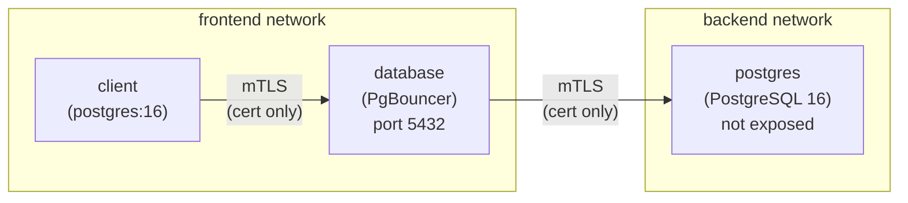
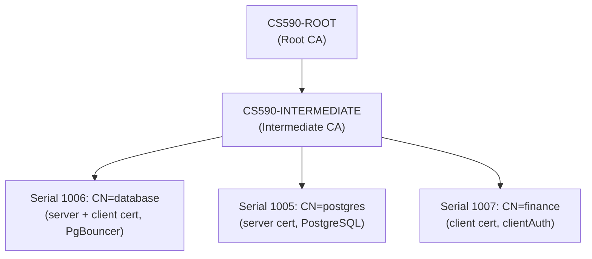

# Database Hardening Report

## 1. Program Description

This project demonstrates database security hardening techniques applied to a PostgreSQL 16 deployment running in Docker Compose. The objective is to transform an insecure baseline system into a defense-in-depth architecture using a connection proxy, transport encryption, mutual authentication, and least-privilege access control.

### Baseline System

The baseline system (`../baseline/docker-compose.yaml`) consists of two containers:

- **database** (`postgres:16`) -- PostgreSQL with port 5432 exposed directly to the host, using a superuser account (`postgres`) with a plaintext password.
- **client** (`debian:trixie`) -- A general-purpose client container.

The database stores sensitive data including employee names, credit card numbers, and salary information (`../baseline/init.sql`).

### Threat Model

The baseline system is vulnerable to the following threats:

| Threat | Description |
|--------|-------------|
| Eavesdropping | All traffic between client and database is unencrypted. An attacker on the network can capture credentials and query results in plaintext. |
| Unauthorized access | Any network host can connect directly to PostgreSQL on port 5432 with only a password. |
| Privilege escalation | The only available account is the `postgres` superuser, which has unrestricted access to all data and database configuration. |
| No client identity verification | The database has no way to verify the identity of connecting clients beyond a shared password. |

## 2. Hardened Architecture And Access Method

The hardened system (`docker-compose.yaml`) introduces four independent security layers and now builds PostgreSQL from a local hardened image instead of running the unmodified upstream image directly.

### Architecture Diagram



- The **client** container exists only on the `frontend` network.
- The **database** service (PgBouncer) bridges both `frontend` and `backend` networks.
- The **postgres** service exists only on the `backend` network and exposes no ports to the host.

### Layer 1 -- Network Isolation

Two Docker networks (`backend` and `frontend`) segment the infrastructure. The client container can only resolve and reach the `database` service (PgBouncer). The `postgres` service is invisible to the client -- DNS resolution fails and TCP connections are impossible.

### Layer 2 -- TLS Everywhere

All database traffic is encrypted in transit:

- **Client to PgBouncer** (frontend TLS): PgBouncer presents a server certificate (CN=`database`) and requires TLS from all connecting clients. Plaintext connections are rejected with `FATAL: SSL required`.
- **PgBouncer to PostgreSQL** (backend TLS): PgBouncer connects to PostgreSQL over TLS (`server_tls_sslmode=verify-full`), verifies the PostgreSQL server certificate against the CA chain, and presents its own client certificate to PostgreSQL.
- **PostgreSQL server TLS**: PostgreSQL is configured with `ssl=on` and presents a server certificate (CN=`postgres`) signed by the intermediate CA.

### Layer 3 -- Mutual TLS (mTLS)

PgBouncer is configured with `client_tls_sslmode=verify-full`, which requires clients to present a valid certificate signed by the trusted CA chain. PostgreSQL is configured with `clientcert=verify-full` and `cert` authentication for the PgBouncer backend role. The result is mutual TLS on both hops with no password fallback.

### Layer 4 -- Authentication And Authorization

Authentication and authorization are separated:

- **Authentication** is certificate-based on both hops:
  1. The frontend client authenticates to PgBouncer with certificate subject `CN=finance`.
  2. PgBouncer authenticates to PostgreSQL with certificate subject `CN=database`.
- **Authorization** is enforced by PostgreSQL roles. PgBouncer uses the least-privilege backend role `database` (`init.sql`), which can only execute `SELECT` queries on the `secret_data` table. `INSERT`, `UPDATE`, and `DELETE` operations are denied by the database.
- **Identity mapping note**: the client connects to PgBouncer as `finance`, but PgBouncer uses a fixed backend PostgreSQL role `database`, so `current_user` and `session_user` inside PostgreSQL resolve to `database`.

### PKI Structure

The certificate infrastructure uses a two-tier hierarchy:



All certificates are signed by the intermediate CA and verified against the full chain (`certs/ca-chain.cert.pem`). The CA and intermediate CA directories are maintained in `../keywork/root_ca/` and `../keywork/intermediate_ca/` respectively.

### Key Files

| File | Purpose |
|------|---------|
| `certs/ca-chain.cert.pem` | CA trust chain (intermediate + root), used by all services for certificate verification |
| `certs/server.crt` / `server.key` | PostgreSQL server certificate and private key (CN=postgres) |
| `certs/pgbouncer.crt` / `pgbouncer.key` | PgBouncer certificate and private key (CN=database, used for both frontend server auth and backend client auth) |
| `certs/client.crt` / `client.key` | Client certificate and private key (CN=finance, extendedKeyUsage=clientAuth) |

### Accessing The Database

From within the client container, connect to the database through PgBouncer as the `finance` user:

```bash
docker compose exec client bash
psql "host=database port=5432 dbname=mydb user=finance \
  sslmode=verify-full sslcert=/certs/client.crt sslkey=/certs/client.key sslrootcert=/certs/ca.crt"
```

PgBouncer authenticates that frontend certificate and then opens the PostgreSQL session as backend role `database`, so PostgreSQL-side role checks apply to `database` rather than `finance`.

If host port `5432` is already in use, the stack can be started with an alternate exposed PgBouncer port:

```bash
PGBOUNCER_HOST_PORT=15432 docker compose up -d --build
```

## 3. CIS Control Implementation Status

This section is intentionally structured so future benchmark controls can be added without rewriting the report. Each control should include the benchmark requirement, build-time remediation path, runtime audit method, and result.

| Order | Control | Objective | Build-Time Hardening | Runtime Audit | Status |
|------:|---------|-----------|----------------------|---------------|--------|
| 1 | CIS 3.1.20 Ensure `log_connections` is enabled | Record all attempted connections for later investigation | Ansible modifies PostgreSQL sample configuration in the hardened image | One-off Compose audit container verifies the live setting with a fresh connection | Implemented and verified |

## 4. Implemented Control 1: CIS 3.1.20 `log_connections`

### Benchmark Requirement

The CIS PostgreSQL 16 Benchmark requires `log_connections` to be set to `on`. This causes each attempted connection and successful completion of authentication to be written to the PostgreSQL logs. The benchmark notes that this is most useful when paired with `log_disconnections`, but this implementation round is scoped to CIS 3.1.20 only.

### Why This Control Matters

PostgreSQL does not keep an internal historical record of connection attempts for later review. Without connection logging, unexpected or unauthorized access attempts are much harder to detect during incident response.

### Implementation Approach

This control is implemented in two parts:

1. **Build-time remediation**: `postgres_hardened/Dockerfile` builds a local PostgreSQL 16 image, copies `postgres_hardened/hardening/` into the image, and runs `ansible-playbook /opt/postgres_hardening/playbook.yml` during `docker build`.
2. **Configuration change**: `postgres_hardened/hardening/controls/cis_3_1_20_log_connections/main.yml` updates PostgreSQL's sample configuration file inside the image so newly initialized data directories inherit `log_connections = 'on'`.
3. **Runtime verification**: `postgres_hardened/hardening/controls/cis_3_1_20_log_connections/audit.yml` connects to the live PostgreSQL service and executes `SHOW log_connections;` in a new session.

This design keeps the hardening action inside the image build, while the audit remains a runtime check against the final deployed system.

### Runtime Audit Execution

After the stack is healthy, the control is audited with:

```bash
docker compose --profile audit run --rm audit
```

The `audit` profile starts a one-off container on the backend network, mounts the required certificates, and runs the Ansible audit playbook against the live `postgres` service. The audit targets PostgreSQL directly rather than PgBouncer because the benchmark control applies to the database server setting itself.

### Audit Result

The runtime audit passed against the implemented system:

```text
CIS 3.1.20 passed: log_connections is enabled in the running PostgreSQL instance.
```

### Evidence Of Compliance

| Verification Item | Evidence |
|-------------------|----------|
| Hardened PostgreSQL image is built locally | `docker compose build postgres` completes successfully and runs the Ansible playbook during image build |
| Hardening is executed only at build time | The remediation is performed in `Dockerfile` via `RUN ansible-playbook ...`; no container startup playbook is used |
| Final running system is compliant | `docker compose --profile audit run --rm audit` returns a passing assertion for `SHOW log_connections;` |

## 5. Security Architecture Verification

The following tests were executed against the running `with_proxy_CIS` stack to verify the broader defense-in-depth architecture that surrounds the CIS control implementation.

| # | Test | Result | Evidence |
|---|------|--------|----------|
| 1 | PostgreSQL port not exposed to host | **PASS** | The `postgres` service has no published host port; only the PgBouncer `database` service is published |
| 2 | SSL enabled on PostgreSQL | **PASS** | `SHOW ssl;` returns `on` |
| 3 | Client with certificate connects without password | **PASS** | `psql` with `sslmode=verify-full sslcert=/certs/client.crt sslkey=/certs/client.key` as `finance` succeeds without a password; PostgreSQL reports `current_user = database` |
| 4 | Client without certificate is rejected | **PASS** | `psql` without client certificate files fails with a TLS certificate-required error |
| 5 | Client without certificate is rejected even over trusted TLS | **PASS** | `psql` with `sslrootcert` but without `sslcert` and `sslkey` fails with a TLS certificate-required error |
| 6 | Backend connection uses certificate-authenticated SSL | **PASS** | `pg_stat_ssl` joined with `pg_stat_activity` shows SSL enabled and a non-null client DN for PgBouncer's `database` session |
| 7 | Backend role cannot `INSERT` | **PASS** | `INSERT INTO secret_data ...` through PgBouncer returns `ERROR: permission denied for table secret_data` |
| 8 | Client cannot reach PostgreSQL directly | **PASS** | Direct resolution or TCP access to `postgres:5432` from the frontend client fails |

### Verification Interpretation

- **Tests 1 and 8** confirm **network isolation**: PostgreSQL is unreachable from both the host and the client container.
- **Tests 2 and 6** confirm **TLS everywhere**: PostgreSQL has SSL enabled, and the backend connection from PgBouncer uses certificate-authenticated TLS.
- **Tests 3, 4, and 5** confirm **passwordless mTLS**: a valid client certificate is required to establish a connection, and no password is needed.
- **Test 7** confirms **least-privilege authorization**: the backend role can read data but cannot modify it.
- **The CIS 3.1.20 audit** confirms that the live PostgreSQL instance is running with `log_connections = on`.

## 6. Baseline Vs. Hardened Comparison

| Aspect | Baseline | Hardened |
|--------|----------|---------|
| Database image strategy | Direct use of upstream image | Local hardened PostgreSQL 16 image built from `postgres_hardened/Dockerfile` |
| Database exposure | Port 5432 exposed to host | PostgreSQL not exposed; only reachable through PgBouncer on the backend network |
| Connection proxy | None | PgBouncer acts as a transparent proxy (service name `database`) |
| Encryption | None | TLS on all connections (client-to-proxy and proxy-to-database) |
| Client identity | None | mTLS; clients must present a CA-signed certificate |
| Authentication | Superuser password only | Certificate-only authentication on both hops |
| Authorization | Superuser (`postgres`) with full access | Least-privilege backend role (`database`) with `SELECT`-only grant |
| Network segmentation | Single default network | Separate `frontend` and `backend` networks |
| CIS benchmark remediation | None | Build-time Ansible hardening plus runtime control audit |
